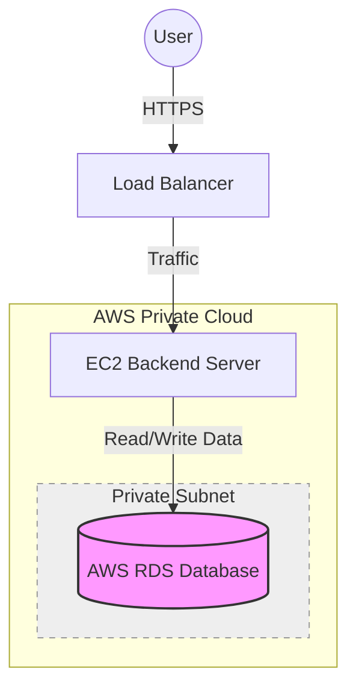

# Production Database Strategy & Scalability Guide

For your target of **100 users** and future growth, keeping your database on **AWS RDS (Relational Database Service)** is the **best choice** for production.

Since your backend is already on AWS (EC2), keeping the database on AWS RDS provides the lowest latency, highest security, and easiest scalability options.

## 1. Why AWS RDS is Best for You
*   **Managed Service**: AWS handles backups, software patching, and automatic failure detection. You focus on your app, not database maintenance.
*   **Scalability**: You can upgrade the server size (Vertical Scaling) with a few clicks or add read-only copies (Read Replicas) for massive traffic.
*   **Performance**: Being in the same data center (Region) as your EC2 backend ensures lightning-fast speeds.

## 2. Recommended Configuration

### For Now (Development / Beta)
*   **Instance**: `db.t3.micro` (Free Tier usage).
*   **Use Case**: Development, testing, and very low traffic (< 10 simultaneous users).
*   **Cost**: Free (for 12 months).

### For Production (100 - 500 Users)
To handle 100 active users reliably without "Connection Timed Out" errors, you should upgrade from the micro instance.

*   **Instance**: `db.t3.small` or **`db.t4g.medium`**.
    *   `t4g` instances use ARM processors and offer better price/performance (up to 40% better).
*   **Storage**: 20 GB - 50 GB General Purpose SSD (gp3).
*   **Backup**: Enable "Automated Backups" (7 days retention).
*   **Estimated Cost**: ~$15 - $30 / month.

### For High Growth (1,000+ Users)
*   **Instance**: `db.m5.large` (Optimized for heavy memory usage).
*   **Architecture**:
    *   **RDS Proxy**: Adds a "Connection Pool" to manage thousands of simultaneous connections efficiently.
    *   **Read Replicas**: Create a copy of your DB just for "Reading" data, letting the main DB focus on "Writing".

## 3. Architecture for 100 Users

## 4. Security Best Practices for Production
Currently, your database might be "Publicly Accessible" for ease of setup. For real production with customer data:

1.  **Disable Public Access**: The database should **only** be accessible by your EC2 instance, not the open internet.
2.  **Use a Private Subnet**: Place the RDS instance in a private subnet.
3.  **Security Groups**:
    *   **RDS Security Group**: Only allow Inbound Traffic on port `5432` from the **EC2 Security Group ID** (not an IP address).

## Summary Recommendation
**Stick with AWS RDS.**
1.  Start with your current `db.t3.micro`.
2.  Monitor CPU and Memory in the AWS Console.
3.  When you see CPU hitting 80% or distinct "slowness", click **Modify** on your instance and upgrade to `db.t3.small` or `db.t4g.medium`. This causes < 5 minutes of downtime.
