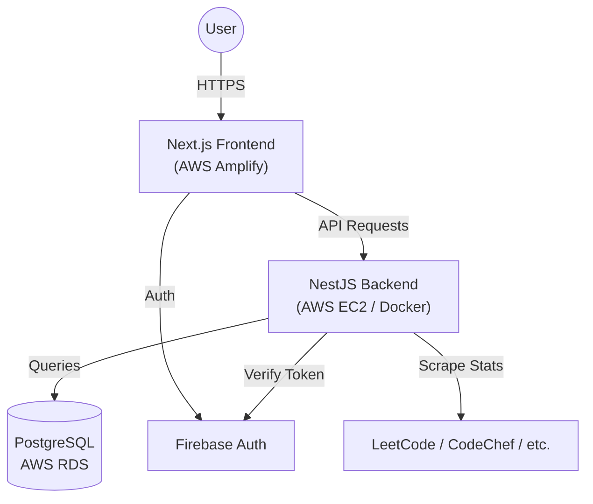

# Wise Academy 🎓

**Wise Academy** is a comprehensive coding education platform designed to help students master data structures and algorithms. It features structured courses, problem tracking, usage statistics from various coding platforms, and a gamified learning experience.


## 🚀 Tech Stack

### Frontend
*   **Framework**: [Next.js 15](https://nextjs.org/) (React 19)
*   **Styling**: [Tailwind CSS v4](https://tailwindcss.com/)
*   **Auth**: Firebase Client SDK
*   **Icons**: Lucide React
*   **Deployment**: AWS Amplify

### Backend
*   **Framework**: [NestJS](https://nestjs.com/)
*   **Language**: TypeScript
*   **Database**: PostgreSQL
*   **ORM**: [Prisma](https://www.prisma.io/)
*   **Auth**: Firebase Admin SDK
*   **Scraping**: Cheerio & Axios (for external stats fetching)
*   **Deployment**: Docker on AWS EC2

### Infrastructure
*   **Database**: AWS RDS (PostgreSQL)
*   **Cloud Provider**: AWS Free Tier
*   **Containerization**: Docker & Docker Compose

---

## ✨ Features

*   **🔐 Authentication**: Secure login/signup using Firebase Auth (Google Sign-in support).
*   **📚 Course Management**: Admin-managed courses, chapters, and problem sets.
*   **✅ Progress Tracking**:
    *   Track solved problems ("Pending" vs "Solved").
    *   Visual progress bars for chapters and courses.
*   **📊 Coder Profile Stats**:
    *   Automatically fetches and displays ratings/stats from **LeetCode**, **CodeForces**, **CodeChef**, **AtCoder**, and **HackerRank**.
*   **🏆 Leaderboard**: Rank students based on problems solved and external contest ratings.
*   **💬 Testimonials**: Student success stories and reviews.
*   **👑 Admin CMS**: Role-based access control allowing Admins to manage content directly.

---

## 🛠️ Architecture



---

## ⚡ Getting Started (Local Development)

### 1. Prerequisites
*   Node.js (v18+)
*   Docker & Docker Compose (optional, for local DB)
*   PostgreSQL (if not using Docker)

### 2. Setup Backend
```bash
cd backend

# Install dependencies
npm install

# Setup Environment Variables
cp .env.example .env
# Edit .env and add your DATABASE_URL and FIREBASE credentials

# Run Database Migrations
npx prisma migrate dev

# Seed Database (Optional)
npm run prisma:seed

# Start Server
npm run start:dev
```
*Backend runs on `http://localhost:3000`*

### 3. Setup Frontend
```bash
cd frontend

# Install dependencies
npm install

# Setup Environment Variables
# Create .env.local and add keys:
# NEXT_PUBLIC_API_URL=http://localhost:3000
# NEXT_PUBLIC_FIREBASE_API_KEY=...
# ... etc

# Start Development Server
npm run dev
```
*Frontend runs on `http://localhost:3001`*

---

## 📂 Project Structure

```
wise-academy/
├── backend/                # NestJS API Server
│   ├── src/
│   │   ├── app.module.ts   # Main Module
│   │   └── ...             # Feature Modules
│   ├── prisma/             # DB Schema & Seeds
│   └── Dockerfile          # Backend Container Config
│
├── frontend/               # Next.js Web App
│   ├── app/                # App Router Pages
│   ├── components/         # Reusable UI Components
│   └── lib/                # Utilities & API Clients
│
├── DEPLOYMENT_AWS.md       # ☁️ Detailed AWS Deployment Guide
├── CONNECT_TO_DB.md        # 🐘 Guide to Connect to RDS Database
└── docker-compose.prod.yml # Production Orchestration
```

---

## ☁️ Deployment

This project is fully deployed on AWS Free Tier.

*   **Frontend**: Hosted on [AWS Amplify](https://aws.amazon.com/amplify/).
*   **Backend**: Running in a Docker container on an **EC2 t2.micro** instance.
*   **Database**: Managed **RDS PostgreSQL (db.t3.micro)** instance.

For full deployment instructions, read **[DEPLOYMENT_AWS.md](./DEPLOYMENT_AWS.md)**.

## 🤝 Contributing
1.  Fork the repository.
2.  Create a feature branch (`git checkout -b feature/amazing-feature`).
3.  Commit changes.
4.  Push to the branch.
5.  Open a Pull Request.
